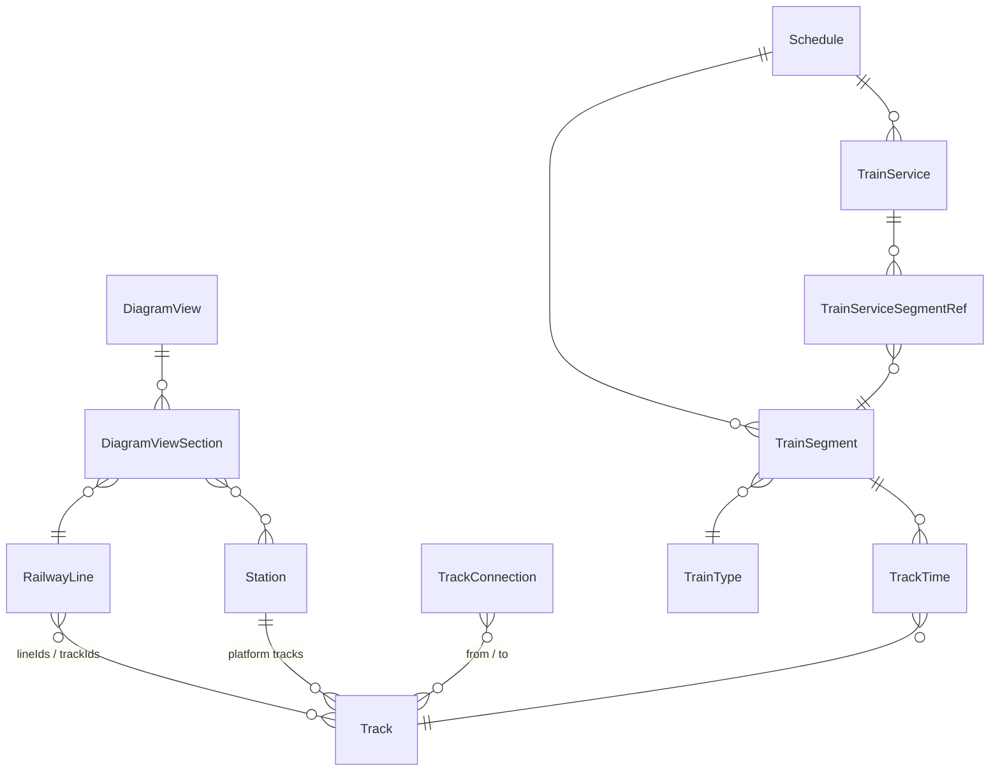

# Data Model Relationships

```mermaid
erDiagram
    RailwayLine }o--o{ Track : "lineIds / trackIds"
    Station ||--o{ Track : "platform tracks"
    TrackConnection }o--o{ Track : "from / to"

    Schedule ||--o{ TrainSegment : ""
    Schedule ||--o{ TrainService : ""
    TrainSegment }o--|| TrainType : ""
    TrainSegment ||--o{ TrackTime : ""
    TrackTime }o--|| Track : ""
    TrainService ||--o{ TrainServiceSegmentRef : ""
    TrainServiceSegmentRef }o--|| TrainSegment : ""

    DiagramView ||--o{ DiagramViewSection : ""
    DiagramViewSection }o--|| RailwayLine : ""
    DiagramViewSection }o--o{ Station : ""
```
